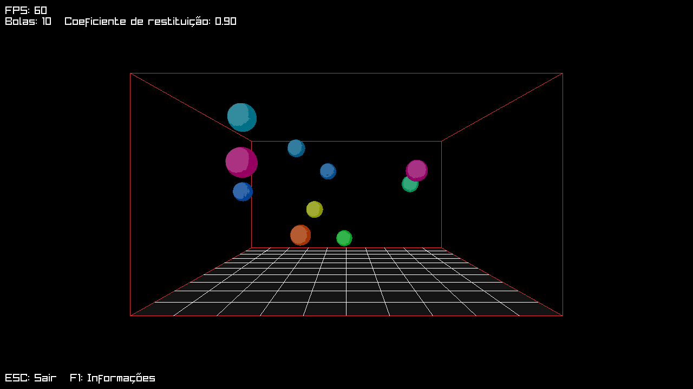

# Simulador de colisões
> Trabalho por Caio Furlan Traebert (Ra: 2780046)

## Opções
- `--no-sound`: Desativa o som das colisões
- `--resolution larguraxaltura`: Especifica o tamanho da janela diretamente

## Dependências
### Raylib

apt:

>sudo apt install raylib

pacman:

>sudo pacman -S raylib

Windows:

>https://www.raylib.com/
